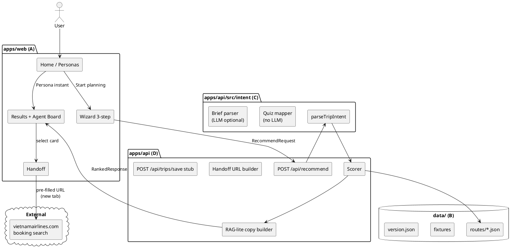

# TDD — Veya (UAVS Hackathon)

> **High-level Technical Design Document** — product scope and delivery plan.  
> **Operational guardrails** for dev/AI remain in §Appendix A–C.  
> **Contracts:** [WORK_SPLIT.md](./WORK_SPLIT.md) · **Folders:** [STRUCTURE.md](./STRUCTURE.md)  
> **VNA pitch map:** [VNA_ALIGNMENT_PLAN.md](./VNA_ALIGNMENT_PLAN.md)  
> **Round 2 (agent canvas):** [TDD-v2.md](./TDD-v2.md) · [TDD-v2-3panel.md](./TDD-v2-3panel.md)

**Repo:** https://github.com/HoangHieuu/veya

---

## I. Objectives

- Help **Australia-origin travellers** (SYD, MEL, PER) discover **where in Vietnam to go** and **which VNA gateway** (HAN, SGN, DAD) fits their trip — before booking on vietnamairlines.com.
- Provide a **fast input path** (~30s): 3-step wizard (origin → trip vibe → when/who) or **persona one-click demo** (Olivia, VFR family, James).
- Return **up to 3 ranked VNA route options** with **plain-language reasons**, **trip sketch**, and **illustrative** connection/duration/fare-band data — not live GDS pricing.
- Surface **destination experience**, not only airport codes: gateway → nearby experiences (e.g. Da Nang → My Khe/Hoi An; SGN → street food / Vung Tau by road) via curated dataset copy and optional **agent destination board** on Results.
- **Hand off** to official VNA search with origin, destination gateway, dates, and adults **pre-filled**; payment and fare shopping stay on VNA.
- Support **3 pilot personas** end-to-end for hackathon demo and judging.
- Integrate **AI appropriately and fast**: intent parsing for free-text briefs; **deterministic quiz path without LLM**; ranking via explainable rules; RAG-lite card copy grounded in `RouteRecord` fields.
- Ship a **working MVP**: monorepo, one-command dev setup, mock mode + live API path, reproducible demo.

---

## II. Background

### Planned modules (ownership)

| Layer | Owner | Planned deliverable |
|-------|-------|---------------------|
| `apps/web` | A | `home → brief → results → handoff`; 3-step wizard; persona one-click; mock mode |
| `apps/api` | D | `POST /api/recommend`, scoring, handoff builder, RAG-lite copy, save stub |
| `apps/api/src/intent` | C | Quiz deterministic mapper; brief → validated `TripIntent` (optional LLM) |
| `data/` | B | 9 `RouteRecord` JSON + version, highlights, licenses, scorer fixtures |
| `shared/types.ts` | D (+ team) | Frozen contracts; changes require team approval |

### Technical Knowledge — Discovery vs booking

- **Marketing fare modules** (e.g. EveryMundo `standardFareModule` in captures) provide route-level indicative prices **without** flight numbers, times, or stops.
- **VNA booking API** (`POST api-des.vietnamairlines.com/v2/search/air-bounds`) provides real itineraries but is **session-bound, short-lived tokens, anti-bot** — **out of scope** for MVP integration.
- MVP uses **curated JSON** + illustrative disclaimers; live price claims are forbidden.

### Technical Knowledge — AI / latency strategy

| Path | LLM? | Target latency |
|------|------|----------------|
| Quiz wizard (`mode=quiz`) | No | &lt;100ms rank |
| Persona demo | No | &lt;100ms (mock) or &lt;100ms rank |
| Free-text brief (`mode=brief`) | Yes, once | &lt;1.5s total |
| Priority re-rank (`cachedIntent`) | No | &lt;50ms |
| Agent board spot pick | No (MVP) | &lt;200ms rule pick from highlights |

- **RAG-lite (MVP):** template-filled `reasons[]` and `tripOutline` from `RouteRecord` + `TripIntent` — **no vector DB**.
- **Policy corpus exception:** optional `POST /api/policy/ask` may use a
  **checked-in** embedding file under `data/policy-corpus/` (not a hosted
  vector DB). Live OpenAI is only for query embedding / short cited synthesis;
  missing keys must surface as unavailable, not as “not in corpus”.
- LLM API keys live **server-side (Person C only)**; browser never calls OpenAI/Gemini directly.

### Problem Statement

VNA and OTAs answer **“which flight at what price?”** but not **“should I fly into Hanoi, Saigon, or Da Nang for *this* trip?”** Australian leisure and VFR travellers drop off overwhelmed before booking. Veya fills the **discovery layer**: structured intent → ranked gateways + trip sketch → trusted handoff to VNA.

---

## III. Design Proposal

### High Level Design

Hybrid UX: **wizard for input (fast, deterministic)** + **agent-style destination board for output (visual, grounded)**. Backend: orchestrator loads dataset, parses intent, scores routes, builds cards.



**Frozen UI state machine** (no new steps in MVP):

```ts
step: "home" | "brief" | "results" | "handoff"
status: "idle" | "loading" | "success" | "error"
```

---

### Objective 1 — Fast trip input (wizard + personas)

**Summary:** Three wizard steps: (1) origin SYD/MEL/PER, (2) trip vibe / experience chips (+ optional one-line note), (3) when + travellers (+ collapsed budget/priority). Submit triggers recommend. Persona cards bypass wizard with pre-built intent.

**Pros:**
- Low fatigue vs long forms; quiz path avoids LLM latency.
- Clear mapping to `RecommendRequest` quiz mode.

**Cons:**
- Less expressive than full chat for edge cases (mitigated by optional vibe note + brief mode).

---

### Objective 2 — Gateway ranking (where to fly in Vietnam)

**Summary:** Scorer ranks curated routes (max 9: 3 origins × 3 gateways) using weighted factors per priority preset. Cards are **destination-first** (gateway name + experience story); flight line (stops, duration) is secondary. Only HAN, SGN, DAD as bookable gateways.

**Pros:**
- Explainable, auditable scores; no hallucinated destinations.
- Matches VNA handoff constraints.

**Cons:**
- Cannot suggest flying into secondary airports; experiences like Vung Tau are **content under SGN gateway**, not separate IATA handoff.

---

### Objective 3 — Destination experience & agent board

**Summary:** On Results, an **agent destination board** (not a full chat replacement) shows 2–4 curated **experience highlights** with images for the #1 route: agent bubbles + bento grid + quick-refine chips (“More food”, “Quieter beach”). Content sourced from `RouteRecord` fields (e.g. extended highlights in JSON — see Appendix B optional field). User may tap chips for one refinement round (filter/reorder highlights, optional copy tweak).

**Pros:**
- Delivers “agentic visualize” wow factor for judges without slow web scrape.
- Reinforces gateway → experience mental model.

**Cons:**
- MVP uses pre-curated images, not live image search.
- Full conversational agent is explicitly out of scope.

---

### Objective 4 — AI intent understanding (when needed)

**Summary:** Person C implements `parseTripIntent(RecommendRequest)`: deterministic quiz mapping; optional LLM for `mode=brief` producing validated `TripIntent` (Zod). D reuses `cachedIntent` on priority re-rank — no second LLM call.

**Pros:**
- AI only where unstructured input exists; fast path for majority of demo clicks.

**Cons:**
- Brief quality depends on parser; requires fixtures and fallback heuristic on LLM 503.

---

### Objective 5 — Trustworthy handoff to VNA

**Summary:** Each `RankedCard` includes `handoff`: origin, destination gateway, depart/return ISO dates, adults, `searchUrl`. Handoff screen sets expectations (live prices on VNA, illustrative data in Veya) and copies trip sketch from results/agent board.

**Pros:**
- Clear product boundary; legally safer than fake booking.
- Aligns with case study “discovery layer”.

**Cons:**
- Deep link format must be validated/mockable; user still picks flight on VNA.

---

### Conclusion

**Preferred approach:** Hybrid **3-step wizard + results agent board + rule-based ranking + RAG-lite copy**, with LLM only for optional free-text briefs. This maximizes **UX speed**, **technical demonstrability**, and **judge-facing AI story** without building a booking site. Live VNA inventory scraping stays out of scope; the optional policy corpus under `data/policy-corpus/` is a **checked-in** reference capture (not a live scrape loop). Persona instant path ensures reliable demo under time pressure.

---

## IV. Backward Compatibility

- **Mock mode preserved:** `VITE_USE_MOCK=true` continues to work if API is down; mock JSON must stay aligned with `shared/types.ts`.
- **Contract stability:** Existing consumers of `RankedResponse` / `RecommendRequest` remain valid; new optional fields (e.g. experience highlights) must be **optional** on `RouteRecord` if added.
- **UI flow:** Still four screens — agent board is a **panel on Results**, not a new route step.
- **Rollback:** Feature flags not required for hackathon; agent board can ship as mock-only component without blocking recommend API.
- **No production clients** yet — first integration is internal web → api.

---

## V. Action Plan

**Delivery order (team chốt):** ship **Phase 1 — wizard spine** first; **Phase 2 — agent visualize** only after E2E demo works.

### Phase 1 — Wizard spine (now)

Goal: `home → brief (3 tap) → results → handoff → VNA` with live or stable mock API.

| No. | Service / Role | Action description | Note |
|-----|----------------|-------------------|------|
| 1 | **A — web/** | 3-step wizard (origin → vibe → when/who); persona → skip to Results | P0 |
| 2 | **A — web/** | Destination-first Results copy; handoff “what to expect on VNA” | P0 |
| 3 | **A — web/** | Wire `VITE_USE_MOCK=false` when D ready | E2E validation |
| 4 | **B — data/** | Ship 9 `RouteRecord` JSON files + `version.json`; `gettingAround`, `tripArchetypes`, `seasonalityNotes` | Reference captures only — do not commit scrape files to repo |
| 5 | **B — data/** | `fixtures/sampleIntent.json` + `expectedTop3.json` | Unblocks D scorer tests |
| 6 | **C — intent/** | Quiz → `TripIntent` deterministic mapper | **No LLM** required for Phase 1 demo |
| 7 | **C — intent/** | Brief → `TripIntent` (LLM + Zod); fixtures Olivia/VFR/James | P1 if time |
| 8 | **D — api/** | `POST /api/recommend`: parse → load dataset → score → cards + handoff | Replace stub with live path |
| 9 | **D — api/** | RAG-lite `reasons[]` + `tripOutline` from `RouteRecord` | No vector DB |
| 10 | **D — api/** | `POST /api/trips/save` stub; optional `/dev/scoring` | Judge traceability |
| 11 | **All** | 3 persona scenarios E2E | Phase 1 Definition of Done |

### Phase 2 — Agent destination board (after Phase 1 E2E)

Goal: agentic visualize on Results — **panel only**, not chat replacing wizard.

| No. | Service / Role | Action description | Note |
|-----|----------------|-------------------|------|
| 12 | **A — web/** | Agent board UI on Results (bento + chips) | Mock JSON first OK |
| 13 | **B — data/** | Experience highlights per gateway (images + transfer notes) | Vung Tau via SGN, Hoi An via DAD |
| 14 | **D — api/** | Optional `POST /api/destination/preview` | Rule pick from highlights |
| 15 | **C — api/** | Optional one-line agent intro copy | Server-side only |
| 16 | **All** | Re-demo with agent + judge narrative | Phase 2 polish |

---

## VI. Assumptions & Open Questions

### Assumptions

- Hackathon judges accept **illustrative** fare/connection data with clear disclaimers.
- VNA handoff URL can be **mock HTML** or best-effort deep link for demo.
- Team of 4 can ship dataset + API + intent in parallel using frozen `shared/types.ts`.
- English-only UI for MVP (`locale` reserved).
- Agent board MVP uses **static/curated** images, not runtime web image aggregation.

### Ambiguities

- Exact VNA booking deep-link query format for production handoff.
- Whether `experienceHighlights[]` becomes a formal optional field on `RouteRecord` or stays embedded in `tripOutline` / `gettingAround` until contract PR.
- LLM provider choice (OpenAI vs Gemini) and 503 fallback policy wording.

### Questions for Reviewers

- ~~Confirm **3-step wizard**~~ → **Chốt:** 3-step wizard; agent board deferred to Phase 2.
- Approve optional `experienceHighlights[]` on `RouteRecord` when Phase 2 starts?
- Exact VNA production deep-link format for handoff?

### Suspected Gaps

- Only 9 routes may produce &lt;3 cards for some origin/intent combos — disclaimer required in `meta`.
- PER-origin connection data may be less confirmed than SYD/MEL — `dataConfidence: illustrative` mandatory where needed.

---

## Appendix A — Out of scope (do not implement without team vote)

### Product / UX

- User login, OAuth, profile, saved trips DB
- Payment, hold seat, fare lock
- Live fares, GDS, scraping `api-des.vietnamairlines.com`
- **Full chatbot replacing wizard**
- Multi-language UI (EN only MVP)
- Native mobile app
- Non-VNA airlines or destinations outside HAN/SGN/DAD / SYD/MEL/PER
- Real email reminders
- Admin CMS, A/B framework

### Technical

- Vector DB / full RAG pipeline (exception: checked-in `data/policy-corpus/` + `POST /api/policy/ask` — see §2 RAG-lite)
- Microservices split, PostgreSQL/Redis requirement
- WebSocket / SSE streaming LLM to UI
- LLM calls from browser
- Person B hosting separate API
- Person C owning scorer weights
- Mandatory E2E suite (unit tests on intent/scorer sufficient if time-boxed)

---

## Appendix B — Role boundaries (dev + AI)

| Role | Path | Branch |
|------|------|--------|
| **A — UI** | `apps/web/**` | `feat/web/*` |
| **B — Data** | `data/**` | `feat/data/*` |
| **C — Intent** | `apps/api/src/intent/**`, `fixtures/**` | `feat/intent/*` |
| **D — API** | `apps/api/**` (except intent if not C), `shared/**` | `feat/api/*` |

**Golden rule:** one PR = one role folder (+ `shared/` only with team approval).

**AI prompt template:**

```
Follow docs/TDD.md strictly. Only edit files in my role folder.
Do not add features listed in Appendix A Out of scope.
Do not change shared/types.ts without explicit contract-change approval.
```

---

## Appendix C — Definition of Done

### Phase 1 (wizard spine)

| Role | Done when |
|------|-----------|
| A | home → brief (3 steps) → results → handoff; persona instant path; mock + live API |
| B | 9 routes load; every card claim traces to JSON |
| C | Quiz path → valid `TripIntent` without LLM |
| D | `curl POST /api/recommend` → valid `RankedResponse` |
| All | Olivia, VFR, James E2E |

### Phase 2 (agent board — after Phase 1)

| Role | Done when |
|------|-----------|
| A | Agent destination panel on Results (mock or live preview) |
| B | Highlight spots + images per gateway in dataset |
| D | Optional `/api/destination/preview` or static mock contract |
| All | Demo includes agent visualize narrative |

**Scoring / handoff summary:** see [WORK_SPLIT.md §4](./WORK_SPLIT.md) for weights, tie-break, `returnDate` formula, `cards.length = min(3, candidateCount)`.

---

*Update this TDD when MVP scope changes — one PR, notify whole team.*
